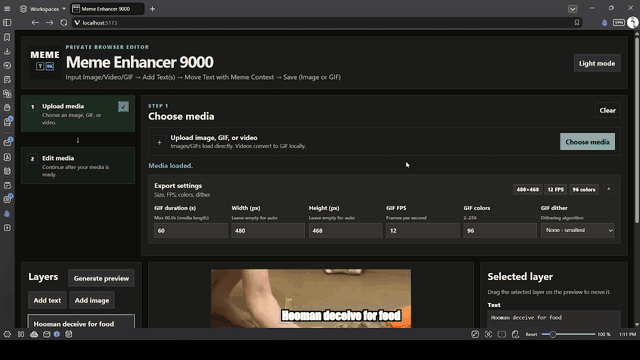

# Meme Enhancer 9000



Private browser editor. Upload Image/Video/GIF, add text/image layers over the media, move them with recorded paths, and save as Image or GIF.

## Stack

- Svelte 5 + TypeScript + Vite
- FFmpeg WASM for local video-to-GIF conversion
- Pure typed domain reducer pattern

## Features

- Upload image, GIF, or video as base media
- Convert uploaded video to GIF locally with FFmpeg WASM
- Add text and image layers over the loaded media
- Move layers by dragging them on the preview
- Record movement paths with GIF restart sync
- Generate PNG/GIF preview and save through browser download

## Quick Start (no dev server)

Build once, then serve with the included production server:

```bash
npm install
npm run build
npm start
```

Then open **http://localhost:9000**.

> **Why a server?** The app uses FFmpeg WASM which relies on `SharedArrayBuffer`. This
> requires special HTTP headers (`Cross-Origin-Opener-Policy` and
> `Cross-Origin-Embedder-Policy`) — you can't just open `index.html` directly.
> The built-in `server.js` handles this for you using only Node.js built-in modules,
> no extra dependencies.

## Development

```bash
npm install
npm run dev
```

## License

GPL-2.0-or-later. See [LICENSE](./LICENSE) for the full terms.

This project uses [FFmpeg](https://ffmpeg.org) via `@ffmpeg/core` (GPL-2.0-or-later).
See [ATTRIBUTION.md](./ATTRIBUTION.md) for third-party license details.
